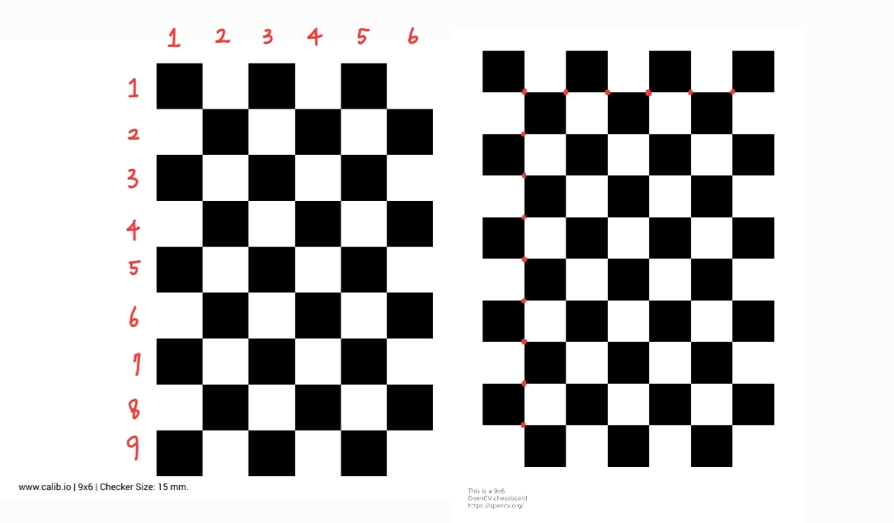

Zhang 알고리즘 캘리브레이션을 구현하고 테스트하는데 필요한 간단한 checkerboard 이미지를 생성하는 방법 2가지를 알게되어 비교해보았다.

## Calib.io 사이트 
[calib.io](https://calib.io/pages/camera-calibration-pattern-generator) 에서는 간단한 체커보드 패턴 뿐만 아니라, ChArUco, Circles 등 다양한 패턴을 생성할 수 있고 pdf 다운이 제공된다.  

## Opencv
[Opencv Create calibration pattern](https://docs.opencv.org/3.4/da/d0d/tutorial_camera_calibration_pattern.html) 문서에서는 캘리브레이션 패턴을 생성하는 파이썬 파일을 제공한다.  

## 주의할 점 
Calib.io 패턴 생성 row, column 값은 말 그대로 square 개수를 의미하고 Opencv 패턴 생성에서 row, column 값은 inner corner 개수를 의미한다. 아래 그림 왼쪽이 calib.io, 오른쪽이 opencv 이다.

## 캘리브레이션 체커보드 설정 
* row, column 값이 짝수/홀수 또는 홀수/짝수 로 서로 다르게 설정해야 rotation invariant 한 패턴이 된다. 
* 보드 영상을 취득 했을때, 영상 대부분을 보드가 차지하게(경험상 절반 넘게) 보드 사이즈를 조절한다.

## 참고 
https://calib.io/blogs/knowledge-base/calibration-patterns-explained
https://docs.opencv.org/3.4/da/d0d/tutorial_camera_calibration_pattern.html